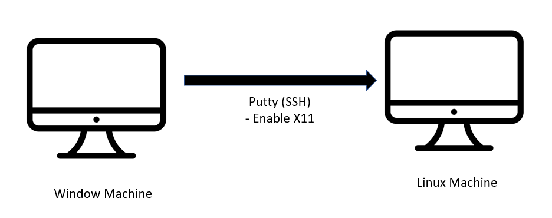

## Enable x11 to install MATLAB Product



---

## Part 1 : Update Linux Standard Based Package

### Ubuntu, Debian
```
sudo apt-get update && sudo apt-get install 
```

### CentOS
```
sudo yum update && sudo yum install redhat-lsb-core 
```

### Fedora
```
sudo dnf update && sudo dnf install redhat-lsb-core
```

### OpenSUSE
```
sudo zypper update && sudo zypper install lsb-core
```

### Arch
```
pacman -Syu lsb-release
```

Display all LSB information specific to your Linux distribution
```
lsb_release -a
```

---

## Part 2 : Install Xming X Server for Windows

Download Link:
https://sourceforge.net/projects/xming/

choosing "Full" for installation type.

After installation, start the Xming X Server for Windows. You should see an icon with an "X" in the system tray if it started successfully.

---

## Part 3 : Enable x11 in ssh(Putty)

1. Install the Putty SSH clients on Windows.
2. Navigate to Connection => SSH => X11 and check the box labeled "Enable X11 forwarding" as shown in the screenshot below:


3. On the remote X server machine, edit the "/etc/ssh/sshd_config" file and make sure that "X11Forwarding" option is set to "Yes" and that the "X11DisplayOffset" is set to an appropriate value (by default, 10).
4. Use Putty to connect to the remote machine, and launch the desired GUI application using the command line (e.g. "./install").

---

## Part 4 : Troubleshooting :
If you see the following errors, here are some tips to solve it:

### Error 1:
### what(): Unable to launch the MATLABWindow application during installation

1. Update your Linux Standard Based Package
2. Remove the following libraries from the MathWorks Installation files, specifically the /bin/glnxa64 directory:
libcrypto.so.1.1
libssl.so.1.1

Reference : 
1) https://www.mathworks.com/matlabcentral/answers/513449-what-unable-to-launch-the-matlabwindow-application-during-installation
2) https://www.mathworks.com/matlabcentral/answers/540707-why-does-matlab-fail-to-install-with-a-std-runtime_error-what-unable-to-launch-the-matlabwind

### Error 2:
### Warning: MATLABWindow application failed to launch. Unable to launch the MATLABWindow application

Refer to https://www.mathworks.com/matlabcentral/answers/364551-why-is-matlab-unable-to-run-the-matlabwindow-application-on-linux

After trying the recommended solution, if you are still encountering Error 1 & Error 2, you might missing some library depencies in your linux machine:

1) libx11 
2) libxcomposite 
3) libxcursor 
4) libxdamage 
5) libxext 
6) libxfixes 
7) libxft 
8) libxi 
9) libxrandr libxrender 
10) libxScrnSaver 
11) libxt 
12) libxtst 
13) libxxf86vm 
14) alsa-lib 
15) atk 
16) cairo 
17) cups-libs 
18) fontconfig 
19) GConf2 
20) gtk2 
21) gdk-pixbuf2 
22) gnome-vfs2 
23) gstreamer1-plugins-base 
24) gstreamer1 
25) pango 
26) libsndfile 
27) libxcb 
28) libxslt

eg. to install the particular package :
You may google "Install libx11 in ubuntu", it should promoted the installation command for your linyx system


